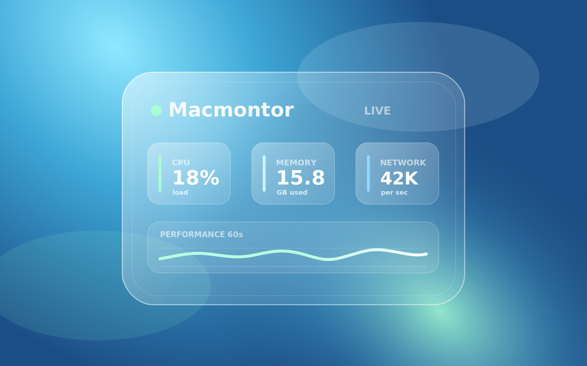
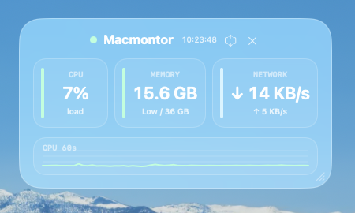

# Macmontor

Macmontor is a lightweight glass-style macOS performance monitor widget built with Swift and AppKit. It helps you monitor CPU usage, memory pressure, network speed, disk space, and top CPU processes directly from your desktop while you work.





## What is Macmontor?

Macmontor is a macOS desktop performance widget for developers, AI users, creators, and Mac power users who want a simple Activity Monitor alternative that stays visible without interrupting their workflow.

It is designed for quick, glanceable system monitoring rather than deep hardware diagnostics. Macmontor focuses on the metrics people usually need during active work: CPU load, memory usage, network throughput, disk space, and the processes currently using the most CPU.

## Who is it for?

- Developers running local builds, servers, Docker, databases, or package managers
- AI users running local models, embeddings, transcription, or inference workloads
- Creators monitoring exports, encoding, rendering, and batch jobs
- Mac users who want a lightweight desktop system monitor instead of opening Activity Monitor
- People who like clean desktop widgets for useful ambient information

## Features

- Real-time CPU usage monitor
- Memory usage and memory pressure monitor
- Network download and upload speed monitor
- Free disk space and reclaimable file cache
- Top CPU process list
- Compact and detail layouts
- Glass and Contrast appearance modes
- Frosted glass desktop widget style
- Resizable and draggable window with saved position
- Menu bar controls
- Always on Top toggle
- Launch at Login toggle
- About window with GitHub link

## Download

Download the latest release from GitHub Releases:

[Macmontor Releases](https://github.com/blackforest-me/Macmontor/releases)

After downloading `Macmontor-v<version>.zip`, unzip it and open `Macmontor.app`.

Because current builds are not Apple Developer signed or notarized yet, macOS may show a security warning on first launch. If that happens, right-click `Macmontor.app`, choose `Open`, then confirm the prompt.

## Requirements

- macOS 14 or later

The release zip does not require Swift, Xcode, Homebrew, Node, or any developer environment.

## Build

Building from source requires a Swift 6 toolchain.

```bash
swift build -c release
scripts/package_app.sh
open dist/Macmontor.app
```

## Release Package

Create a local zip package for distribution:

```bash
scripts/release_zip.sh
```

The generated file is written to `dist/Macmontor-v<version>.zip`.

## Development

Run from source:

```bash
swift run
```

Regenerate the app icon after editing `scripts/generate_icon.swift`:

```bash
scripts/generate_app_icon.sh
```

## License

MIT
